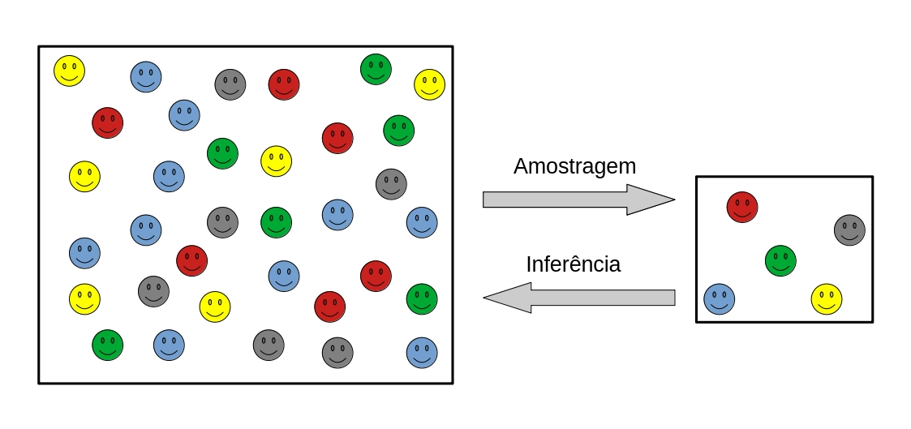
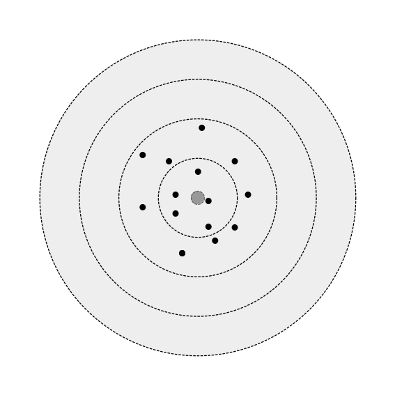
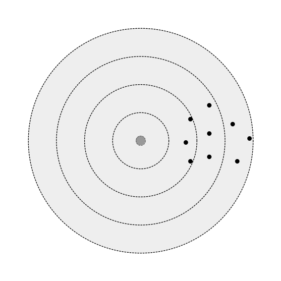
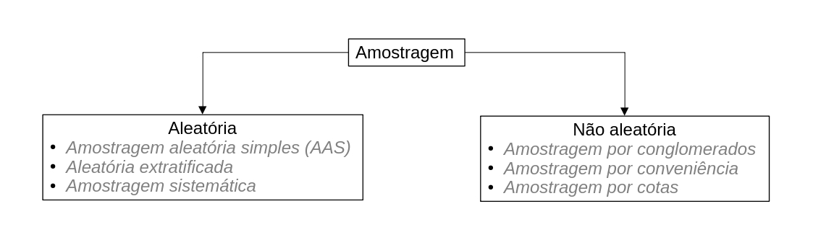
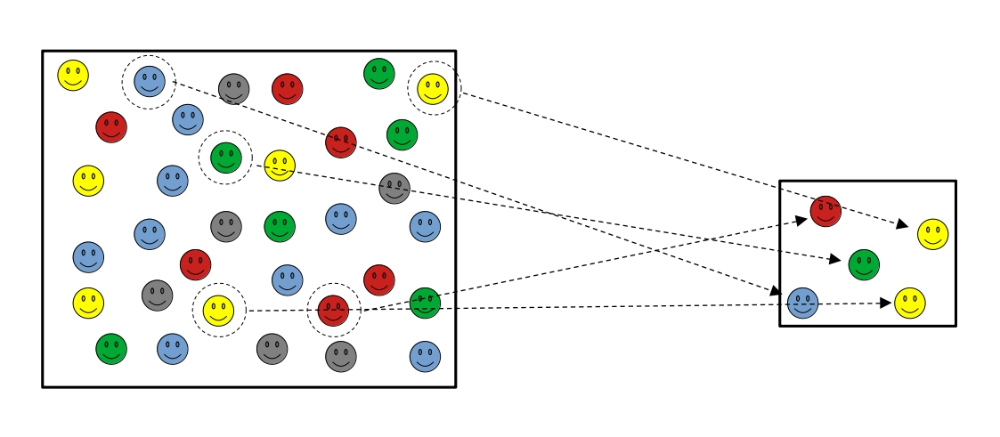
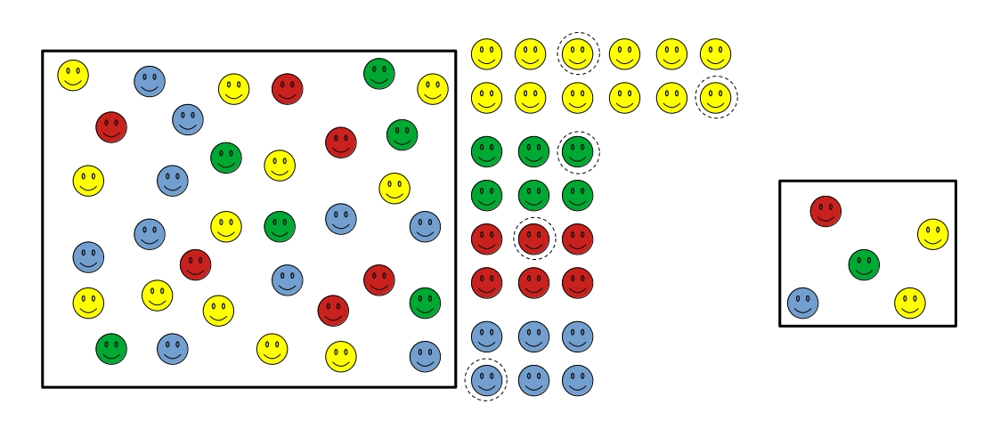
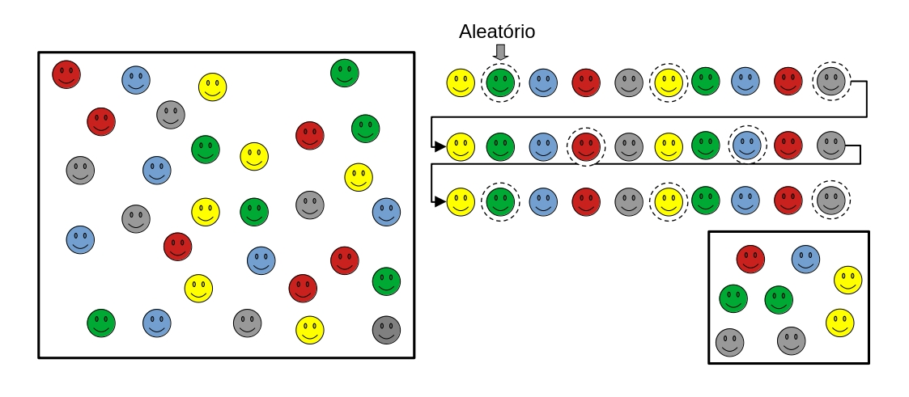
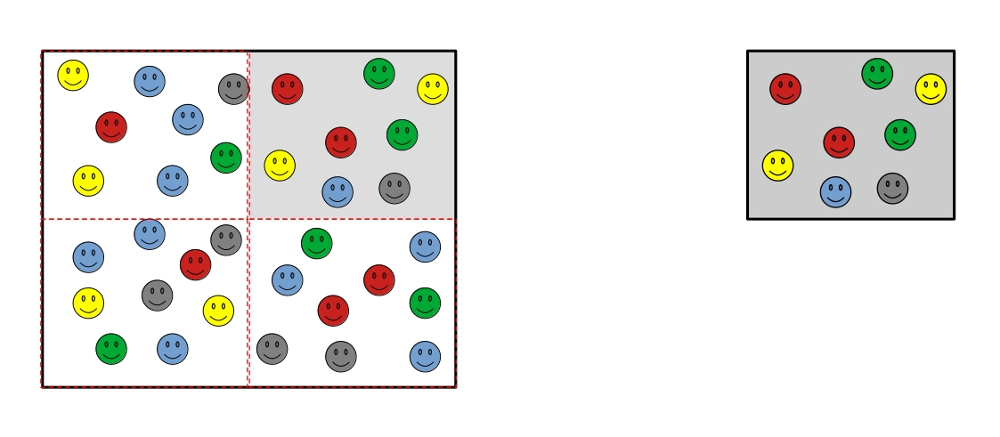
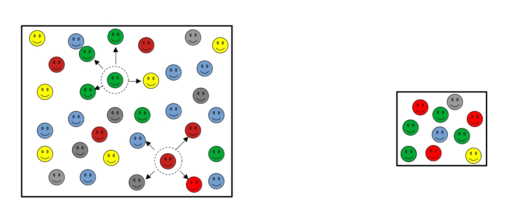

# População versus amostra

* População: Conjunto de todos os indivíduos de interesse do pesquisador;

* Amostra: Subconjunto representativo da população.

{#fig-populacao_amostra width=70%}

# Viés

Erros de amostragem produzidos de maneira sistemática diferentemente de erros aleatórios. A consequência é que o viés reduz a representatividade da sua amostra.

Suponha uma arma de fogo que realiza vários disparos em um alvo. Se a mira da arma estiver calibrada, podemos dizer que os disparos de aproximarão do alvo (neste caso todos os disparos não atingirão exatamente o alvo devido a influência de fatores externos não controláveis, como velocidade do vento, variação da densidade do ar, força da gravidade, raio de curvatura da Terra, etc). Entretanto se a mira estiver ligeiramente descalibrada para a esquerda, os disparos ocorrerão aproximadamente em um lugar à direita do alvo. Podemos dizer que no segundo caso a arma está viesada pela mira mal calibrada, e este viés destruiu a representatividade dessa arma em relação as demais armas de precisão, cuja estimativa é acertar o alvo.

::: {#fig-vieses layout-ncol=2}

{#fig-naoviesada width=70%}

{#fig-viesada width=70%}

Exemplo de um tipo de viés

:::

::: {.callout-note} 

Um bom exemplo de como o viés afeta a nossa pesquisa, podemos citar como exemplo a pesquisa eleitoral da literary digest. A revista previu uma vitória esmagadora do candidato republicado "Al Landon" contra o democrata "Franklin Roosevelt". Convencida de que para obter uma boa previsão seria necessário coletar o maior número possível de informações. Para isso ela aplicou uma pesquisa como toda a sua base de assinantes, além de listas adicionais como listas telefônicas assinantes de outras revistas e participantes de clubes privados. Por outro lado, o estatístico George Gallup afirmou que a vitória seria do partido democrata. Gallup chegou a essa conclusão realizando uma pesquisa bem menor e aplicando métodos de amostragem por cotas. Após o resultado das eleições, Roosevelt venceu com uma margem de votos próxima do resultado previsto por Gallup. Podemos dizer que o erro cometido pela literay digest se resume principalmente no processo de amostragem, enviesado pelo nível social dos eleitores que não representavam toda a comunidade dos EUA [@Bruce2019].

:::

## Tipos de viés

* Viés de seleção;

  - Processo de amostragem inadequado;
  - Viés de não resposta.

* Viés de informação;

  - Viés de memória;
  - Viés do observador;
  - Viés de instrumentação.

* Viés de confundimento;

  - Presença de variáveis confundidoras que possuem impactos nas variáveis dependente e independente.

::: {.callout-tip title = "Aleatoriedade e representatividade"}

Na prática, a maneira eficiente de reduzir os vieses e aumentar a representatividade da sua amostra está diretamente associado com a aleatoriedade na coleta dos dados.

:::

# Delineamento experimental

Conjunto de regras que determina como o experimento deverá acontecer, como o processo de amostragem deverá acontecer. Este processo se baseia em três tipos distintos.

* Levantamento amostral

A amostra é obtida de uma população conhecida utilizando protocolos bem definidos

* Planejamento experimental

Processo de amostragem cujo objetivo principal é analisar o efeito de uma variável (variável independente) sobre outra (variável dependente). O experimento é geralmente realizado em laboratório e ambientes controlados. Pode apresentar custo elevado, tem alta reprodutibilidade e baixa representatividade.

* Levantamento observacional: O objetivo principal é analisar a relação entre variáveis, e geralmente é feito sem a intervenção do pesquisador. Geralmente possui custo menor que o anterior, tem baixa reprodutibilidade e alta representatividade.

## Levantamento amostral

Os principais processos de amostragem se resumem especificamente em processos aleatórios ou probabilísticos e não aleatórios ou não probabilísticos. O conceito de amostragem probabilística se deve ao fato de que todos os indivíduos da população possuem a mesma probabilidade de serem escolhidos em cada amostragem. Neste caso, existe uma certa aleatoriedade na escolha dos indivíduos que irão compor a amostra. A @fig-amostragem apresenta os principais processos de amostragem aleatória e não aleatória.

:::{.callout-important title="Amostragem com ou sem reposição"}

O processo de amostragem pode ser feita com ou sem reposição dos indivíduos coletados. Entretando, os resultados são obtidos de maneira diferente em cada caso. Modelos estatísticos mais simples são pensado de maneira que os processos de amostragem são feitas <alerta>com reposição dos indivíduos</alerta>.

:::

{#fig-amostragem width=80%}

## Amostragem aleatória simples

Neste tipo de amostragem os elementos são escolhidos ao acaso. Na @fig-amostragem_aas temos uma população formada por 34 elementos. Foram escolhidos ao acaso cinco para compor a amostra.

### Vantagens

O processo garante total aleatoriedade na amostragem e a máxima redução de vieses.

### Desvantagens

Ocorre o risco da não representatividade de parte da população, principalmente para amostras pequenas.

:::{.callout-important}

* Os modelos estatísticos são feitos e pensados em cima da suposição de que as amostras foram obtidas utilizando o processo de amostragem AAS COM REPOSIÇÃO. A @fig-amostragem_aas define bem como esse processo acontece. Os elementos são sorteados ao acaso dentro da população;

* Na amostragem AAS, a representatividade da amostra aumenta com o tamanho da amostra.

:::

{#fig-amostragem_aas width=80%}

## Amostragem aleatória extratificada

Neste tipo de amostragem, antes da coleta os elementos são agrupados de acordo com as suas características e a amostra é formada por integrantes de cada grupo de acordo com a sua quantidade. Na @fig-amostragem_extratificada temos a população formada por 30 elementos. Os elementos foram inicialmente agrupados de acordo com a sua cor. Os elementos da cor amarela contribuem com o dobro em comparação aos demais membros.

### Vantagens

O processo garante a representatividade de todos os individuos da população.

### Desvantagens

Requer mais trabalho em relação ao método AAS, além do conhecimento de informações antecipadas a respeito da população.

{#fig-amostragem_extratificada width=80%}

### Exemplo

Agrupe todos os alunos do seu interesse de acordo com as características a serem analisadas (gênero, ano, curso, turma, etc).

## Amostragem sistemática

Ordena-se os indivíduos da população, em seguida os elementos da amostra são obtidos em intervalos pré-determinados. A aleatoriedade do processo acontece quando escolhemos ao acaso o primeiro indivíduo. Na @fig-amostragem_sistematica temos a população formada por 30 elementos. Ordenou-se os elementos da população e em seguida foi escolhido aleatoriamente o elemento de ordem dois. Os demais elementos foram escolhidos em intervalos fixos a cada quatro elementos.

### Desvantagem

A ordenação pode levar a subrepresentação de um ou mais grupos.

{#fig-amostragem_sistematica width=80%}

### Exemplo

Monte uma amostra seguindo o número de matrícula dos alunos.

## Amostragem por conglomerados

Neste caso, elementos individuais não são sorteados, mas sim um grupo de indivíduos. Na @fig-amostragem_conglomerado, os elementos da população foram separados em quatro grupos. Em seguida, o grupo cinza foi escolhido aleatoriamente para que os seus elementos representassem a amostra da população.

### Vantagem

Redução de custo e tempo.

### Desvantagem

Ocorre o risco do grupo sorteado ser mais homogêneo que a população.

{#fig-amostragem_conglomerado width=80%}

### Exemplo

Monte uma amostra contendo alunos de uma sala de aula que foi escolhida ao acaso.

## Amostragem por bola de neve

Identifica-se poucos elementos que o pesquisador tem acesso. Em seguida, solicita-se que esses elementos indiquem outros indivíduos para compor a amostra. Na @fig-amostragem_bola_neve dois elementos foram escolhidos convenientemente. Em seguida, cada elemento indicou mais quatro para compor a amostra. O processo continua até que o pesquisador tenha coletado a quantidade suficiente de elementos.

### Vantagens

Redução de custo e tempo

### Desvantagens

* Ocorre o risco dos indivíduos indicarem outros similares, tornando a amostra mais homogênea que a população;

* Forte presença de vieses durante a amostragem.

{#fig-amostragem_bola_neve width=80%}

### Exemplo

Monte uma amostra com alunos que você tem acesso e peça indicações para compor a amostra.

## Amostragem por cotas

Similar ao método de amostragem extratificada. Contudo, os elementos não são obtidos aleatoriamente (ao acaso) dentro de cada grupo que chamamos de cota.

### Desvantagem

Pode haver vieses durante a coleta em cada grupo.

### Exemplo

Agrupe alunos que você tem acesso de acordo com as características de interesse (gênero, ano, curso, turma, etc).

## Amostragem por conveniência

A amostra é composta por elementos de fácil acesso.

### Vantagens

* Redução de custo e tempo

### Desvantagem

* A amostra pode não ser representativa.

::: {.callout-tip title="Qual amostragem escolher?"}

Por questões de representatividade, deve-se priorizar métodos de amostragem probabilísticas, especialmente os métodos AAS e extratificado. Caso não seja possível, métodos de amostragem não-probabilísticas podem ser usadas como alternativa.

:::
