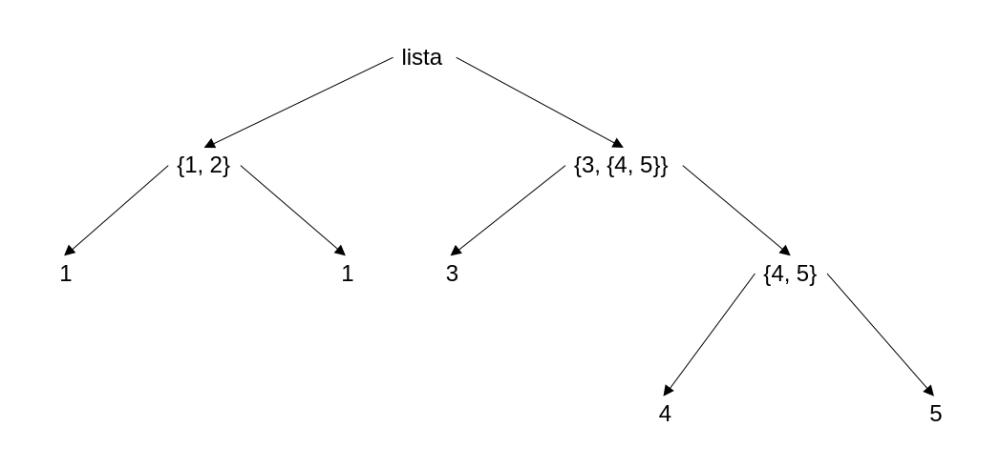

```{r}
#| include: false
#
source(here::here("", "_common.R"))
```

# Estrutura de dados principais do R

* Vetores atômicos

Estrutura básica do R formada por elementos do mesmo tipo.

```{r}
  vetor_letras <- c("a", "b", "c", "d")
  vetor_letras
  vetor_numeros <- c(1, 2, 3, 4)
  vetor_numeros
```

* Vetores recursivos (listas):

  * Podem ser formados por elementos de tipos distintos;
  * Podem ser formados por listas e sublistas.

```{r}
  lista <- list("a", 1, TRUE, NA)
  lista
```

:::{callout-tip}
Podemos usar a função concatenar `c()` para construir um vetor atômico, enquanto que `list()` é usado para construir uma lista.
:::

## Tipo de dados

Os elementos de um **vetor atômico** são definidos pelos tipos abaixo,

* Inteiro

```{r}
1
```

* Real

```{r}
pi
```

* Qualitativo

```{r}
texto <- "R é o melhor! ;)"
texto
```

* Complexo

```{r}
2+4i
```

* Lógico (`TRUE` ou `FALSE`)

```{r}
4*4 == 16
```

### Funções de teste

Para checar se o objeto corresponde ao tipo desejado, usando a função `is.[...]` (veja a @tbl-funcoes_teste, modificado de [@rcienciadadoswebsite]).

:::{#tbl-funcoes_teste tbl-colwidths="[50, 50]"}

|                | lógico | inteiro | Real | Complexo | Texto | lista |
|----------------|--------|---------|------|----------|-------|-------|
| is.logical()   |    x   |         |      |          |       |       |
| is.integer()   |        |    x    |      |          |       |       |
| is.double()    |        |         |   x  |          |       |       |
| is.numeric()   |        |    x    |   x  |          |       |       |
| is.complex()   |        |         |      |    x     |       |       |
| is.na()        |        |    x    |   x  |    x     |   x   |       |
| is.character() |        |         |      |          |   x   |       |
| is.atomic()    |    x   |    x    |   x  |    x     |   x   |       |
| is.list()      |        |         |      |          |       |   x   |
| is.vector()    |    x   |    x    |   x  |    x     |   x   |   x   |

Funções teste no R base

:::

Lembrando que é possível verificar o tipo de dado do objeto com a função `typeof()`,
```{r}
typeof("texto")
```

:::{.callout-tip}
A função `is.na()` permite verificar o valor especial `NA`. Temos também a função `is.null()` que verifica se um determinado valor é nulo (`NULL`). Lembrando que `NA` não é o mesmo que `NULL`. `NA` significa valor faltante, ou seja, sabemos da sua existência mas não sabemos o seu valor, enquanto que `NULL` significa a inexistência desse valor.
:::

:::{.callout-note title="Exercício"}
Verifique o tipo de dados dos seguintes valores:

1. $\pi$
3. $e^1$
3. $\sqrt{-4}$
4. $x = \{1, 2, 3, 4, 5\}$
5. nomes = {Marcos, Antônio, Vanessa}

:::

### Conversão de dados

Para transformar dados usamos a função `as.[...]`,

* Inteiro

```{r}
as.integer(pi)
```

* Real

```{r}
as.numeric("3.14")
```

* Qualitativo

```{r}
as.character(pi)
```

* Complexo

```{r}
as.complex(2)
```

## Dados hierárquicos

Listas são úteis na construção de dados hierárquicos, ou seja, uma estrutura em forma de árvores.

```{r}
  lista <- list(list(1, 2), list(3, list(4, 5)))
  str(lista)
```

:::{#fig-estrutura_arvore}

{width=75%}

:::

:::{callout-tip}
A função `str()` permite visualizar objetos de maneira mais humanamente acessível. No caso de dados hierárquicos, a função auxilia na visualização da hierarquia da lista.
:::

## Lista nomeada

Os elementos de uma lista podem ser nomeados,

```{r}
  lista_nomeada <- list(caracter = "a", numero = 2, logico = TRUE, dado_faltante = NA)
  lista_nomeada
```

### Como acessar elementos de uma lista

Para acessar um item da lista nomeada, basta usar o operador `$` ou `[[]]`.

```{r}
  lista_nomeada$caracter
  is.na(lista_nomeada$dado_faltante)
  as.character(lista_nomeada$numero)
  lista_nomeada$logico <- FALSE
  lista_nomeada$logico
```

:::{.callout-note title="Exercício"}

Construa uma lista com os seguintes dados de uma pessoa:

* Nome: João Carlos Silveira

* Endereço: Rua Pedro Koppe, 100, Irati-PR

* Escolaridade: Ensino médio completo

* Estado civil: Solteiro

Em seguida, atualize esta lista mudando o endereço desta pessoa para Rua Trajano Grácia, 240 - Centro, Irati-PR.

:::

:::{.callout-note title="Exercício"}

Construa uma lista com os seguintes elementos:

* score: 1, 2, 3

* nome:João, Leticia, Marcos

* pontuação: 100, 90, 75

Em seguida, acesse o score da Letícia à partir desta lista.

:::

## Vetores e listas aumentadas

Vetores e listas aumentadas são vetores ou listas que possuem atributos. Os atributos podem ser acessados a partir do comando `attributes`.

```{r}
data <- as.Date("2026/06/09")
attributes(data)
vetor_atomico <- c(1, 2, 3, 4)
attributes(vetor_atomico)
```

## Atributos de vetores aumentados

* Nome: Usados para nomear os elementos de uma lista ou um vetor.

```{r}
scores <- c(88, 92, 79)
attr(scores, "names") <- c("Alice", "Bob", "Charlie")
names(scores)
scores
attributes(scores)
```

* Dimensão: Define a dimensão de matrizes e arrays que são construídos a partir de um vetor.

```{r, echo=TRUE}
vec <- c(1, 2, 3, 4)
matriz <- matrix(vec, ncol = 2)
matriz
dim(matriz)
```

No comando ao lado, construimos uma matriz com o comando matrix a partir do vetor vec, em seguida acessamos o seu atributo dim, que no caso indica a ordem da matriz de 2 linhas e 2 colunas.

:::{.callout-note title="Exercício"}

Construa a matriz abaixo.

\begin{pmatrix}
  1 & 4 & 7 \\
  2 & 5 & 8 \\
  3 & 6 & 9
\end{pmatrix}

:::

:::{.callout-note title="Exercício"}

Faça o produto vetorial abaixo (Dica: utilize o operador `%*%`).

\begin{equation}
\begin{pmatrix}
  1 & 4 & 7 \\
  2 & 5 & 8 \\
  3 & 6 & 9
\end{pmatrix}
\begin{pmatrix}
  1 \\
  0 \\
  0
\end{pmatrix}
= ?
\end{equation}

:::

:::{.callout-note title="Exercício"}

Construa a mesma matriz anterior a partir de um array e com a utilização do atributo *dim*.

:::

## Atributos de vetores aumentados

* Classe: Usado para implementar atributos e métodos da programação orientada a objetos.

```{r}
  dados <- data.frame(nome = c("Roberto", "Vanessa", "Carlos"),
                      idade = c(12, 17, 21)
                      )
#
  class(dados)
```

É possível acessar os métodos de uma função a partir da classe com o comando `methods`.

```{r}
methods("as.Date")
```

:::{.callout-note title="Exercício"}

Acesse a documentação da função methods utilizando o comando `?methods`.

:::

# Data frames

x

# Séries temporais

x